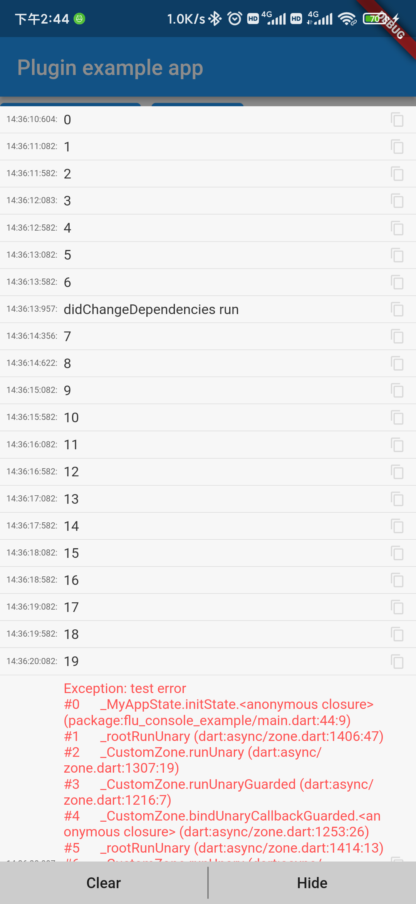

# flu_console

Let flutter print logs to display on the phone

## Getting Started

### step 1: init

```dart

    FluConsole.run(() {
        runApp(const App());
    });

    //or passing in 'enableLog' parameters

    FluConsole.run(() {
        runApp(const App());
    },enableLog: true);
```

### step 2: show console enter button or show console Panel

```dart
   
    FluConsole.showConsoleButton(context);
    // or 
    Navigator.of(ctx).push(PageNavAnimBuilder(const LogPrintPanel()));
```

### run example

```shell
cd ./example
flutter run
```

## ScreenShot



